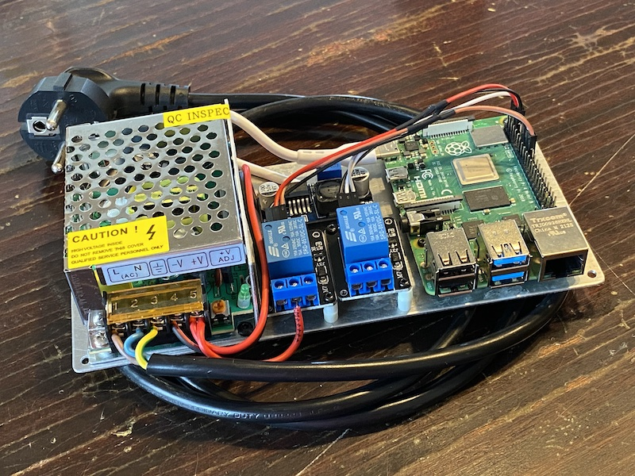

# MOPK Bot

This is a simple Discord bot that opens the MOPK doors when someone sends the appropriate message in the appropriate channel. It runs in a Raspberry Pi, controlling two relays (one for each door).

The hardware looks like this:


On the left side there is 12V power supply. Behind the two relay boards, a step down DC converter provides 5V to the Raspberry Pi through the USB-C port.

The code is based on [this](https://realpython.com/how-to-make-a-discord-bot-python/) excellent tutorial.

## Running

The Raspberry Pi runs Ubuntu 22.04 LTS and [Docker](https://docs.docker.com/engine/install/ubuntu/). The device gets its network from eth0 using DHCP, while wlan0 is set up as an access point, as described [here](https://raspberrypi.stackexchange.com/questions/109425/ubuntu-server-18-wifi-hotspot-setup) (with [WPA2 support](https://askubuntu.com/questions/1440707/netplan-access-point-setup-with-wpa2-authentication)). The relays are connected to GPIO pins 23 and 24.

To run the bot:
```bash
docker run -d \
  --restart=always \
  --name mopk-bot \
  --device /dev/gpiomem \
  -e DISCORD_TOKEN=<the bot token> \
  -e DISCORD_GUILD=<the server name> \
  -e DISCORD_CHANNEL=<the channel name> \
  chazapis/mopk-bot:20240428
```

## Developing

First create a `.env` file with the following contents:
```
DISCORD_TOKEN=<the bot token>
DISCORD_GUILD=<the server name>
DISCORD_CHANNEL=<the channel name>
```

Then run locally with:
```bash
python3 -m venv venv
source venv/bin/activate
pip install -r requirements.txt
python bot.py
```
